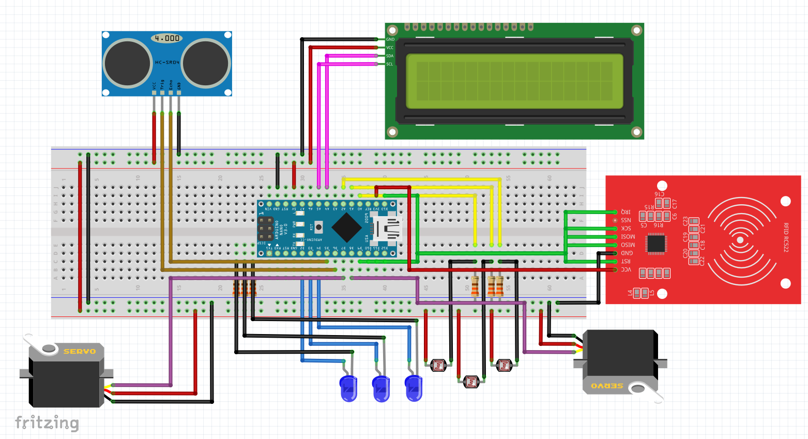

# SmartParking

Desenvolvimento de um estacionamento inteligente com arduíno nano, baseado em controle de vaga e controle de entrada de veículos com Leitor RFID

# Funcionamento do Sistema 
  
  A programação do arduino para realizar as tarefas necessárias que torna um estacionamento inteligente, execulta as seguintes funções:
   + VerificarVagas();
   + VerificarSaida();
   + VerificarEntrada();
   + ExibindoLCD();
   + AbrirCancelaSair();
   + FecharCancelaSai();
   + AbrirCancelaEnt();
   + FecharCancelaEnt()

  ### Esquematização do Circuito 

   
   

  
  
  
